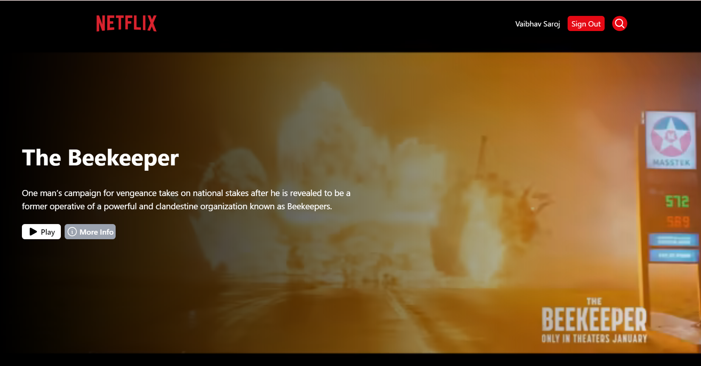
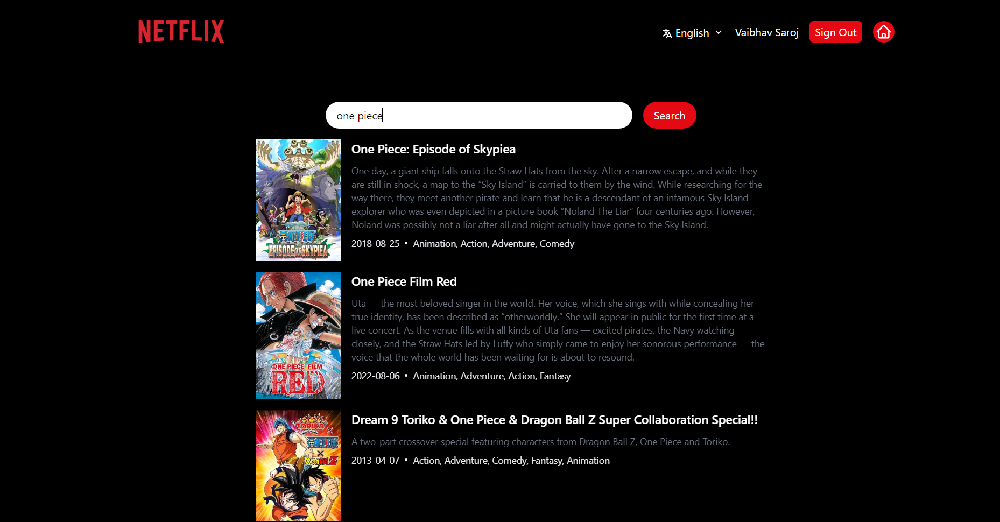
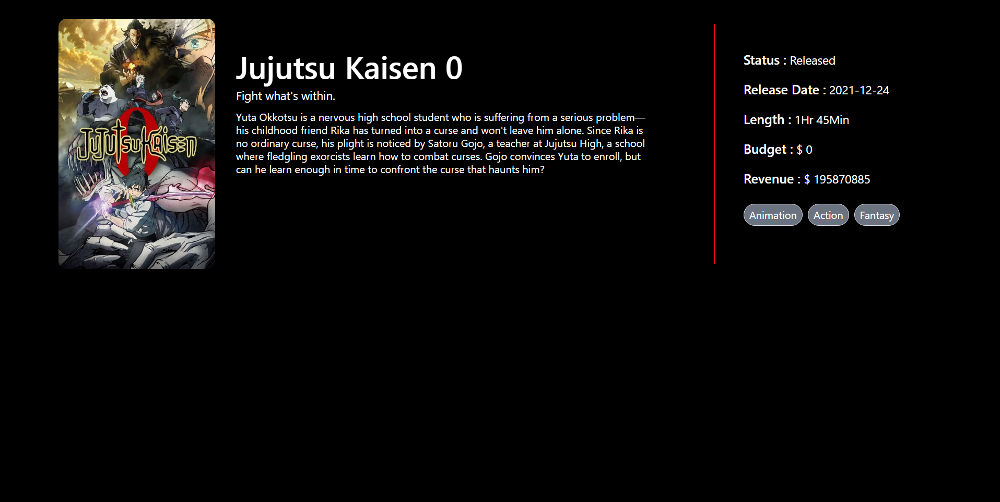
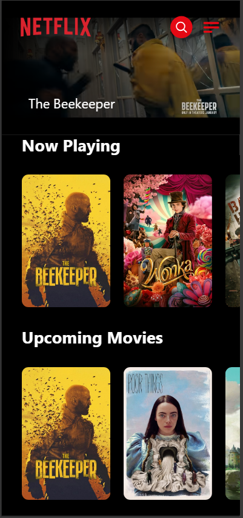
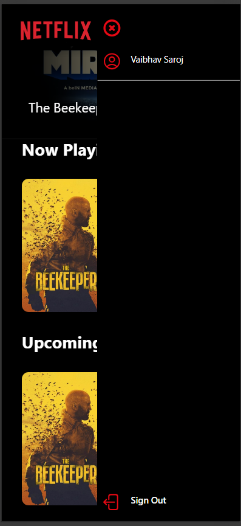
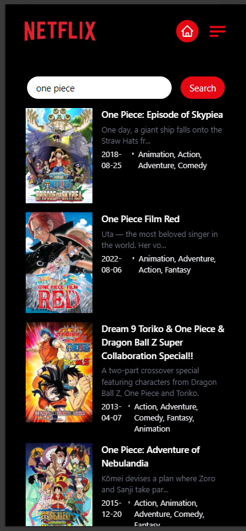
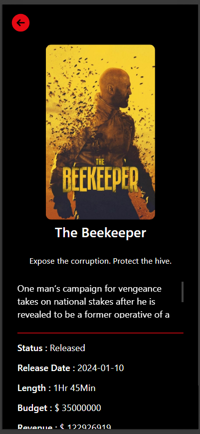

## Tech Stack

- ReactJS (Frontend)
- Tailwind CSS
- Google Firebase  for Authentication and Database
- Redux  for State Management
- TMDB  API for Movie Data
   

## Features

- User Registration & Login with Email.
- Dashboard to display the list of movies based on different categories like Trending Now, Popular, Top Rated etc.
- Dashboard to view all movies and TV shows
- Search bar to search for specific movie or show by title.
- Search Movies by Title or Genre
- View Details of a movie / TV Show including Ratings, Reviews, Casts etc.

## Installation Instructions:
1. Clone this repository by running `git clone https://github.com/diegueus9/movieapp.git` in your terminal.
2. Navigate to the project directory by running `cd movieapp`.
3. Run `npm install` or `yarn install` to install all necessary dependencies.
4. Create a new file named `.env`, then copy the content of `.env.example` into it. Fill in the empty fields with your own values, especially the REACT_

# Demo Video

#### [Old Version](https://github.com/vaibhav1281/Netflix-Clone/assets/93854530/5d3166a4-1101-4385-a395-a7fe07d70959) 
 
https://github.com/vaibhav1281/Netflix-Clone/assets/93854530/8166a876-d579-4278-90e4-d1d2f5d5186a

## Screenshots

  

